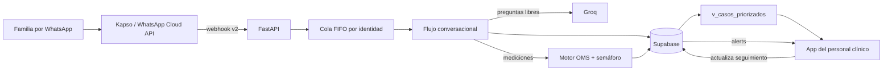

# NutriAcompaña API

Backend del canal familiar de **Yanapiri Wawa** para el reto 5 “Crecer Mejor”.
Recibe mensajes de WhatsApp mediante Kapso, guía el registro de niñas y niños
menores de 5 años, calcula indicadores antropométricos OMS y comparte con la app
clínica una base Supabase común.

> El semáforo es un mecanismo de orientación y priorización. No realiza un
> diagnóstico ni reemplaza la valoración del personal de salud.

## Qué incluye

- FastAPI con cola FIFO por identidad de WhatsApp y límite de concurrencia.
- Webhook Kapso v2, validación HMAC del cuerpo crudo, lotes e idempotencia.
- Flujo guiado para registro, peso, longitud/talla, MUAC y edema bilateral.
- Seguimiento remoto de condiciones reportadas, suplementos y adherencia diaria.
- Groq como capa conversacional para preguntas libres; el cálculo OMS y el
  semáforo permanecen deterministas.
- Motor LMS determinista con tablas oficiales OMS 2006 versionadas en `seeds/who`.
- Semáforo verde/amarillo/rojo y creación automática de alertas.
- Supabase con RLS por establecimiento y fallback en memoria sin credenciales.
- Clasificador e5 opcional para intención/FAQ; nunca decide el resultado clínico.

## Cómo se trabajará en el proyecto

### 1. Objetivo común

Yanapiri Wawa busca conectar dos experiencias que comparten la misma información:

- **Canal familiar:** una conversación por WhatsApp que ayuda a registrar a la
  niña o niño, guía la toma de medidas y devuelve una orientación comprensible.
- **Canal clínico:** una aplicación para que el personal autorizado vea
  trayectorias, casos priorizados y alertas, y registre el estado del seguimiento.

El bot y la app clínica no deben convertirse en dos sistemas separados. Ambos
trabajan sobre un único proyecto Supabase y un único contrato de datos. El bot
escribe registros y mediciones; la app clínica consulta los casos y gestiona las
alertas. Ninguno debe mantener una copia independiente de la información.

### 2. Arquitectura acordada



La separación es intencional:

- **Kapso** transporta mensajes; no contiene la lógica de negocio.
- **FastAPI** recibe, valida, encola y responde los webhooks.
- **El flujo determinista** controla registro, consentimiento y mediciones.
- **Groq** comprende preguntas libres y mejora la conversación, pero no toma
  decisiones clínicas ni escribe mediciones.
- **El motor antropométrico** calcula indicadores con tablas OMS versionadas.
- **Supabase** es la fuente única de verdad y aplica seguridad mediante RLS.
- **La app clínica** consume vistas y tablas autorizadas; no llama al bot.

### 3. Recorrido de una familia

El flujo principal que debe funcionar de extremo a extremo es el siguiente:

1. La familia escribe al número de WhatsApp de Yanapiri Wawa.
2. Kapso envía el evento a `POST /webhooks/kapso`.
3. La API valida la firma, evita duplicados y encola el mensaje por identidad.
4. El bot solicita datos de la persona cuidadora y de la niña o niño.
5. Antes de guardar, muestra un resumen y solicita consentimiento explícito.
6. Después del alta pregunta si desea registrar la primera medición.
7. Si responde **SÍ**, solicita peso, longitud/talla, posición, MUAC y edema.
8. Antes de persistir, muestra nuevamente un resumen para confirmación.
9. El motor calcula WAZ, HAZ y WLZ/WHZ, y aplica las reglas del semáforo.
10. Se guarda la medición en la trayectoria y, si corresponde, se crea una alerta.
11. Si existe una alerta, la familia puede indicar que acudirá, reportar que ya
    acudió, solicitar ayuda por una barrera de acceso o pedir recomendaciones.
12. Cada respuesta crea un evento en `alert_followup_events`; nunca resuelve la
    alerta ni modifica su nivel clínico.
13. La app clínica muestra el caso y la bitácora al establecimiento que
    corresponda. Solo el personal autorizado puede avanzar `alerts.estado` hasta
    `resuelta`.

#### Comunicación de resultados

WhatsApp está diseñado para madres, padres y otras personas cuidadoras adultas,
principalmente mayores de 30 años. Las respuestas usan frases directas, fechas
en formato `DD/MM/AAAA`, nombres completos de las medidas y un máximo de dos o
tres acciones concretas. No muestran siglas como WAZ, HAZ o WHZ, ni valores en
desviaciones estándar. Ese detalle permanece en Supabase para la app clínica.

El reporte familiar sigue esta estructura:

1. qué medición se guardó;
2. orientación expresada en lenguaje cotidiano;
3. qué puede hacer ahora la persona cuidadora;
4. recordatorio de que no reemplaza la evaluación profesional.

Si los valores superan los límites de plausibilidad biológica de la OMS, la
medición confirmada por la familia se conserva con
`validation_status = 'needs_review'`, pero no se clasifica con semáforo ni genera
una alerta clínica. El bot explica que puede existir un error de medición, unidad
o digitación y solicita repetirla. Los indicadores técnicos solo se calculan y
persisten cuando la combinación puede interpretarse. La app debe diferenciar
claramente “pendiente de confirmar” de los colores verde, amarillo y rojo.

La captura es deliberadamente flexible: entiende peso en kg o gramos, talla en
metros, centímetros o milímetros y MUAC en centímetros o milímetros. Los rangos
amplios de almacenamiento evitan perder un dato confirmado por la familia. Esto
no amplía los límites clínicos: si el motor OMS no puede interpretar el valor, se
guarda como pendiente de confirmar, sin semáforo ni alerta automática. Solo se
rechazan entradas sin un número, negativas, iguales a cero o fuera incluso del
rango técnico de captura.

Los comandos `REGISTRAR`, `MEDICIÓN`, `TALLA`, `ESTADO`, `ESTABLECIMIENTO`,
`SEGUIMIENTO`, `SUPLEMENTOS`, `TOMA`, `AYUDA` y `CANCELAR` siempre
deben funcionar aunque Groq esté caído o no tenga cuota.

Para reducir el abandono, `REGISTRO RÁPIDO` acepta en un solo mensaje los datos
etiquetados de la persona cuidadora, relación, niña o niño, nacimiento, sexo,
distrito y establecimiento. El bot normaliza la fecha y el sexo, muestra un
resumen y no persiste nada hasta recibir una confirmación explícita. Si ya existe
una niña o niño con el mismo nombre y nacimiento para esa persona cuidadora,
recupera el registro existente y evita crear un duplicado.

`ESTADO` confirma qué niñas o niños están registrados y muestra como máximo sus
dos mediciones más recientes. La trayectoria completa y los gráficos se consultan
en la aplicación familiar configurada con `SEGUIMIENTO_URL`; ningún identificador
clínico se añade al enlace compartido por WhatsApp.

#### Acciones y seguimiento familiar

Una alerta amarilla o roja abre un menú privado con cinco acciones: consultar el
establecimiento registrado, indicar cuándo podría acudir, reportar asistencia,
informar una barrera de acceso o solicitar recomendaciones generales. Los eventos
permitidos para el cuidador están limitados en el backend y se valida que la
alerta pertenezca a una niña o niño bajo su cuidado.

`attendance_reported` significa únicamente “la familia informó que acudió”. La
alerta permanece activa hasta que el personal la verifique. Esta separación evita
que una respuesta por WhatsApp se interprete como confirmación clínica.

#### Seguimiento remoto de suplementación (SRSI)

La opción 7 y los comandos `SUPLEMENTOS` o `TOMA` permiten registrar una condición
comunicada por la familia, una indicación de hierro, micronutrientes en polvo,
vitaminas o zinc, la toma del día y el motivo de una omisión. Todo dato ingresado
por WhatsApp nace con `verification_status = 'reported'`: no equivale a un
diagnóstico ni a una prescripción verificada.

`child_conditions` conserva la condición, fecha, nombre textual de quien habría
diagnosticado, establecimiento y referencias para una integración externa. La app
clínica puede vincularla después con `professional_profiles.user_id`, verificarla
o rechazarla. `supplement_plans` guarda por separado la indicación; el bot no
calcula ni permite modificar dosis, frecuencia o duración.

`supplement_intake_events` registra `taken`, `not_taken` o `pending` una sola vez
por plan y día. Los días sin respuesta no se interpretan automáticamente como
incumplimiento. `supplement_reminder_preferences` conserva el consentimiento,
hora y zona horaria. El envío automático queda desacoplado: fuera de la ventana
de atención de 24 horas debe usar una plantilla aprobada en Kapso/WhatsApp.

Para habilitar el módulo en un Supabase existente, ejecutar
`db/migrations/20260813_supplement_tracking.sql` en SQL Editor.

#### Guardrails clínicos y de privacidad

- Groq no recibe el historial de registro; solo la consulta actual minimizada.
- Antes de llamar al LLM se redactan nombres conocidos, teléfonos, correos y
  fechas detectables.
- Las salidas que intentan diagnosticar, mostrar z-scores o indicar dosis se
  sustituyen por un mensaje seguro.
- Los signos de peligro conocidos activan una indicación determinista de atención
  presencial y no se delegan al LLM.
- El contenido de mensajes permanece oculto en logs por defecto. Solo puede
  habilitarse localmente con `LOG_MESSAGE_CONTENT=true` usando datos ficticios.
- La app familiar recibe una URL general configurada mediante `SEGUIMIENTO_URL`;
  el bot nunca agrega el `child_id` ni datos clínicos a la URL.

La persona que conversa es siempre una persona adulta. Al iniciar un registro,
el bot identifica si es madre, padre u otra persona cuidadora, solicita su nombre
y después pregunta qué niña o niño desea registrar. Esa relación se guarda en
`caregivers.relationship`; las niñas y niños permanecen en `children` y nunca se
confunden con la identidad de WhatsApp de quien escribe.

La fecha de nacimiento puede recibirse como `2024-03-18`, `18/03/2024` o dentro
de una frase como “nació el 18 de marzo de 2024”. El sexo acepta expresiones
como “es niña”, “varón”, “femenino”, `F`, “masculino” o `M`. Ambos valores
normalizados aparecen en el resumen para que la persona cuidadora los confirme.

El establecimiento es opcional durante el alta. Respuestas como “no lo sé”, “no
recuerdo”, “desconozco” u “omitir” dejan el caso pendiente sin bloquear el
registro. Más adelante, la opción 5, el comando `ESTABLECIMIENTO` o una frase
como “quiero agregar su centro de salud” permite agregarlo o cambiarlo.

Además de los comandos, el enrutador acepta frases naturales como “quiero
registrar a mi hija”, “quiero medir a Mateo” o “quiero registrar una talla de
82.5 cm”. Si la frase ya contiene una talla válida, la conserva y solicita los
demás datos necesarios para completar la evaluación. El comando `TALLA` también
inicia el mismo flujo. La talla no se guarda aislada porque el cálculo OMS del
MVP requiere completar peso, posición de medición y los demás datos de control.

Cuando corresponde medir longitud en una niña o niño menor de 2 años, el bot
comparte este tutorial del Instituto Nacional de Salud:
https://www.youtube.com/watch?v=0C6CUT8XlRc. El enlace no se presenta como una
guía para talla de pie en mayores de 2 años.

El registro de la familia es permanente hasta que exista un proceso autorizado
de eliminación. En cambio, el paso conversacional incompleto vence después de
120 minutos de inactividad. Cada respuesta renueva ese plazo. Al volver, el bot
reconoce la identidad de WhatsApp y muestra un menú personalizado con las niñas
o niños ya registrados. Este plazo se configura con
`CONVERSATION_SESSION_MINUTES` y es independiente de la ventana de 24 horas de
WhatsApp administrada por Meta.

### 4. Responsabilidades por componente

| Componente | Responsabilidad | No debe hacer |
|---|---|---|
| Bot de WhatsApp | Guiar, validar formatos, solicitar confirmación y comunicar resultados | Diagnosticar o inventar datos |
| Groq | Resolver preguntas libres y redactar respuestas claras | Calcular z-scores, modificar el semáforo o guardar registros |
| Motor OMS | Calcular indicadores y advertir medidas improbables | Interpretar conversaciones |
| Supabase | Persistir, relacionar y proteger los datos | Contener lógica conversacional duplicada |
| App clínica | Priorizar casos y gestionar el seguimiento | Crear su propio esquema o usar la service role |
| Kapso | Recibir y enviar mensajes oficiales de WhatsApp | Decidir el flujo o almacenar el expediente clínico |

### 5. Plan de implementación

#### Fase A — Base técnica y canal de WhatsApp

Objetivo: lograr una conversación confiable desde un teléfono real.

- Configurar Kapso, número, webhook HTTPS y secreto HMAC.
- Normalizar teléfono y BSUID sin confundir el identificador del remitente.
- Responder HTTP 200 rápidamente y procesar fuera del webhook.
- Mantener orden FIFO por familia, idempotencia y logs sin datos completos.
- Incorporar una espera aleatoria de 2 a 4 segundos antes de responder.
- Manejar la ventana de 24 horas y preparar una plantilla aprobada para
  recontactar cuando dicha ventana esté cerrada.

**Criterio de terminado:** un mensaje entrante produce una sola respuesta,
mantiene el orden y no se pierde aunque el usuario escriba varias veces.

#### Fase B — Registro familiar

Objetivo: crear una identidad reutilizable para cuidador y niña o niño.

- Recoger nombre del cuidador, nombre del niño, nacimiento, sexo y distrito.
- Recoger el establecimiento reportado sin asignarlo por aproximación.
- Mostrar resumen y pedir consentimiento antes de persistir.
- Permitir cancelar en cualquier paso.
- Ofrecer inmediatamente el registro de la primera medición.

**Criterio de terminado:** el alta queda relacionada con la identidad de
WhatsApp y puede recuperarse en conversaciones posteriores.

#### Fase C — Medición y orientación

Objetivo: construir una trayectoria, no evaluar un punto aislado.

- Guiar peso, talla/longitud, posición, MUAC y edema bilateral.
- Validar unidades y rangos antes de calcular.
- Usar LMS y tablas oficiales OMS almacenadas en `seeds/who`.
- Guardar los valores originales, indicadores calculados, reglas activadas y
  versión del algoritmo.
- Crear alertas amarillas o rojas sin presentar el resultado como diagnóstico.

**Criterio de terminado:** una medición confirmada aparece en la trayectoria y
genera el mismo resultado al repetirse con las mismas entradas.

#### Fase D — Integración con la app clínica

Objetivo: hacer visible la información útil para el personal de salud.

- Ejecutar `db/schema.sql` en el proyecto Supabase compartido.
- Migrar la demo de ids enteros a UUID.
- Autenticar al personal y asociarlo mediante `health_center_members`.
- Consumir `v_casos_priorizados` para la lista de trabajo.
- Mostrar trayectoria, última medición, razones del semáforo y alertas.
- Permitir solo las transiciones válidas de `alerts.estado`.
- Resolver administrativamente casos cuyo establecimiento quedó sin vincular.

**Criterio de terminado:** un registro creado por WhatsApp aparece en la app
correcta sin copiar datos ni desactivar RLS.

#### Fase E — Conversación con Groq

Objetivo: permitir que la familia pregunte con lenguaje natural.

- Enviar a Groq únicamente consultas que no pertenezcan a un paso clínico activo.
- Limitar el historial y evitar incluir información innecesaria.
- Usar instrucciones que prohíban diagnóstico, cálculo o tratamiento inventado.
- Conservar FAQ y menú local como fallback si Groq falla o supera la cuota.
- Revisar con el equipo clínico las respuestas demostradas en el pitch.

**Criterio de terminado:** desconectar `GROQ_API_KEY` no impide registrar ni
consultar mediciones; solo reduce la flexibilidad de las preguntas libres.

#### Fase F — Calidad, despliegue y demostración

Objetivo: tener un prototipo defendible y repetible durante la hackatón.

- Ejecutar pruebas unitarias y del flujo completo antes de integrar cambios.
- Probar desarrollo con datos ficticios y producción con secretos separados.
- Desplegar FastAPI en una URL HTTPS estable; ngrok se reserva para desarrollo.
- Configurar el webhook de producción con la URL estable.
- Preparar familias ficticias con casos verde, amarillo y rojo.
- Ensayar una demostración que empiece en WhatsApp y termine en la app clínica.
- Documentar limitaciones, consentimiento, seguridad y validación pendiente.

**Criterio de terminado:** otra persona del equipo puede ejecutar la demo usando
este README sin depender de la computadora del desarrollador principal.

### 6. Estado actual y siguientes prioridades

| Área | Estado | Siguiente acción |
|---|---|---|
| Webhook Kapso y envío | Implementado | Crear/probar plantilla para ventana cerrada |
| Cola, firma e idempotencia | Implementado | Prueba de carga corta con mensajes consecutivos |
| Registro de cuidador y niño | Implementado | Validar textos y consentimiento con el equipo |
| Primera medición tras el alta | Implementado | Probar el flujo completo desde WhatsApp |
| Motor OMS y semáforo | Implementado para el MVP | Revisión clínica de reglas y mensajes |
| Groq para preguntas libres | Implementado con fallback | Crear banco de preguntas de evaluación |
| Esquema Supabase y RLS | Preparado | Configurar proyecto compartido y ejecutar migración |
| App clínica | En desarrollo por el equipo | Adoptar UUID, vistas y estados comunes |
| Despliegue estable | Pendiente | Elegir proveedor y registrar secretos de producción |
| Validación con usuarios | Pendiente | Probar primero con datos ficticios y guion aprobado |

La prioridad inmediata es sustituir el fallback en memoria por el Supabase
compartido. Mientras `supabase=False`, reiniciar el backend elimina registros y
la app clínica no puede ver lo capturado por WhatsApp.

### 7. Forma de trabajo del equipo

Para evitar que bot y app se contradigan:

1. `db/schema.sql` es la única fuente de migraciones y tiene un responsable claro.
2. Antes de cambiar una tabla, se revisa el impacto en bot, RLS, vistas y app.
3. Los valores `semaforo`, `alerts.nivel` y `alerts.estado` no se renombran solo
   en un lado; el contrato se actualiza de forma coordinada.
4. Cada cambio se trabaja en una rama corta y se integra después de pruebas.
5. Los PR deben explicar qué cambia, cómo se probó y si altera datos o seguridad.
6. Nunca se suben `.env`, service roles, API keys, teléfonos reales ni datos de
   niñas o niños al repositorio.
7. Las pruebas y capturas del pitch usan personas ficticias.
8. Una decisión clínica requiere revisión clínica; una decisión de seguridad o
   datos requiere revisión técnica.

Una distribución práctica del trabajo es:

- **Backend/bot:** Kapso, FastAPI, conversación, Groq y motor antropométrico.
- **App clínica:** autenticación, casos priorizados, trayectorias y alertas.
- **Datos:** Supabase, migraciones, RLS, catálogos y calidad de datos.
- **Producto/clínica:** guion familiar, reglas, mensajes de acción y demo.

### 8. Definición de terminado

Una funcionalidad no se considera terminada solo porque se vea en pantalla. Debe:

- funcionar con entradas válidas y rechazar formatos incorrectos;
- conservar el flujo después de mensajes consecutivos o repetidos;
- persistir en Supabase cuando corresponda;
- respetar RLS y no exponer secretos;
- tener al menos una prueba automatizada proporcional al riesgo;
- mantener un fallback seguro ante fallos de Groq o Kapso;
- usar lenguaje de orientación, no de diagnóstico;
- quedar documentada si modifica configuración, esquema o contrato con la app.

### 9. Guion mínimo para la demostración

1. Una madre, padre o cuidador escribe “Hola”.
2. Registra a una niña o niño ficticio y acepta el consentimiento.
3. Acepta realizar la primera medición y confirma los datos.
4. El bot muestra el semáforo y explica el siguiente paso.
5. La persona cuidadora indica cuándo acudirá o reporta una barrera de acceso.
6. La app clínica actualiza su lista, muestra el caso y su último evento familiar.
7. El personal abre la alerta y cambia su estado a `en_seguimiento`.
8. La familia reporta que acudió; la alerta sigue activa hasta validación clínica.

Para el pitch conviene mostrar un único recorrido completo y estable antes que
muchas funciones aisladas. El valor central es la continuidad entre familia,
trayectoria y personal de salud.

## Arranque local

```bash
python -m venv .venv
# Windows: .venv\Scripts\activate
pip install -r requirements.txt
copy .env.development.example .env.development
uvicorn app.main:app --reload --port 7860
```

El backend reconoce dos entornos mediante `APP_ENV`:

```text
development -> .env.development (local; permite fallbacks)
production  -> .env.production o secretos del proveedor (sin fallbacks)
```

`dev` y `local` son alias de `development`; `prod` es alias de `production`.
Las variables configuradas directamente en el sistema o proveedor tienen
prioridad sobre los archivos. El `.env` antiguo solo se lee como compatibilidad
en desarrollo y nunca en producción.

Para probar producción localmente:

```powershell
Copy-Item .env.production.example .env.production
$env:APP_ENV = "production"
uvicorn app.main:app --port 7860
```

Producción se detiene durante el arranque si faltan Supabase o las credenciales
críticas de Kapso. Los archivos `.env.development` y `.env.production` están
ignorados por Git; solo se versionan sus ejemplos.

Sin Supabase ni Kapso, todo funciona en memoria y las respuestas de WhatsApp se
imprimen como `kapso-mock`. Prueba el diálogo:

```bash
curl -X POST http://localhost:7860/chat \
  -H "Content-Type: application/json" \
  -d '{"identidad":"familia-demo","mensaje":"hola"}'
```

Documentación interactiva: `http://localhost:7860/docs`.

## Supabase y la app clínica

1. Crear un único proyecto Supabase para bot y app.
2. Ejecutar todo [`db/schema.sql`](db/schema.sql) en SQL Editor.
3. Configurar `SUPABASE_URL` y `SUPABASE_SERVICE_KEY` solo en este servidor.
4. En la app usar la anon key **junto con autenticación de usuario**. Asignar cada
   usuario a `health_center_members`; RLS limita los datos a su establecimiento.
5. La app lee `v_casos_priorizados`, `alerts` y `alert_followup_events`, y
   actualiza únicamente
   `alerts.estado`: `abierta → vista → en_seguimiento → resuelta`.

La vista priorizada expone `last_followup_event`, `followup_planned_for`,
`followup_barrier` y `last_followup_at`. La app debe presentar
`attendance_reported` como información declarada por la familia, no como atención
clínicamente confirmada.

Durante el registro el bot pide nombre o código RENIPRESS del establecimiento. Si
no puede resolverlo de forma inequívoca, conserva `reported_health_center` y deja
el caso sin asignar para que un usuario `admin` lo vincule; no adivina un centro
solo por distrito. `district_recommendations` contiene el catálogo curado común.

La service role no debe aparecer en JavaScript, una app móvil, capturas ni commits.
Las migraciones se modifican en este repositorio, no desde la app clínica.

La demo web publicada aún apunta a `127.0.0.1:8000`, usa endpoints REST propios y
convierte ids a enteros. La migración concreta a UUID + Supabase está documentada
en [`docs/app-integration.md`](docs/app-integration.md); `v_app_children_compat`
sirve como puente visual temporal.

## Kapso

Configura en `.env.development` para local o en los secretos del proveedor para
producción:

```dotenv
KAPSO_API_KEY=...
KAPSO_PHONE_NUMBER_ID=...
KAPSO_WEBHOOK_SECRET=...
```

En Kapso crea un webhook v2 para el evento `whatsapp.message.received` apuntando a:

```text
https://TU-DOMINIO/webhooks/kapso
```

El backend acepta eventos individuales o lotes, texto, botones/listas y audio si
Kapso entrega una transcripción. Responde HTTP 200 antes de procesar la conversación.
La ruta antigua `/webhook/whatsapp` se mantiene únicamente como alias temporal del
mismo controlador Kapso.

Las respuestas de WhatsApp esperan aleatoriamente entre 2 y 4 segundos para
sentirse naturales y permitir que Kapso sincronice la ventana de atención. Se
puede ajustar con `BOT_REPLY_DELAY_MIN_SECONDS` y
`BOT_REPLY_DELAY_MAX_SECONDS`.

## Groq

Configura `GROQ_API_KEY` para habilitar respuestas a preguntas libres. El modelo
predeterminado es `llama-3.1-8b-instant` y puede cambiarse con `GROQ_MODEL`.
Groq no registra mediciones, no calcula z-scores y no decide el semáforo.

## Motor antropométrico

`POST /assessments/preview` permite validar el motor sin persistir:

```json
{
  "birth_date": "2024-08-12",
  "measured_at": "2025-08-12",
  "sex": "F",
  "weight_kg": 8.2,
  "height_cm": 72.4,
  "height_mode": "length",
  "muac_mm": 121,
  "bilateral_edema": false
}
```

Calcula peso/edad (WAZ), talla/edad (HAZ) y peso/longitud o peso/talla
(WLZ/WHZ). Si la posición no corresponde a la edad, aplica el ajuste OMS de 0.7
cm y lo informa. Los resultados biológicamente improbables activan confirmación.

Reglas MVP:

- rojo: edema bilateral, MUAC <115 mm (6–59 meses) o algún indicador <−3 DE;
- amarillo: MUAC 115–124 mm (6–59 meses) o algún indicador entre −3 y −2 DE;
- verde: ningún umbral disponible activado.

Ejemplos educativos verificados con el motor actual:

- verde: niña de 2 años, 11.5 kg, 85 cm, MUAC 135 mm y sin edema;
- amarillo: niña de 1 año, 8.9 kg, 74 cm y MUAC 120 mm;
- rojo: niño de 2 años, 12 kg, 86 cm y edema bilateral reportado.

Estos valores sirven para la demostración y no representan diagnósticos ni
historias clínicas reales.

Si el proyecto Supabase ya existía antes de esta función, ejecutar
`db/migrations/20260813_measurement_review.sql` y después
`db/migrations/20260813_flexible_measurement_capture.sql` en SQL Editor. Una
instalación nueva puede ejecutar directamente `db/schema.sql` completo.

Antes de una prueba con familias o una institución, estas reglas y los textos de
acción deben ser validados por el responsable clínico del equipo.

## Pruebas

```bash
pytest -q
```

## Fuentes técnicas

- [WHO Child Growth Standards](https://www.who.int/tools/child-growth-standards/standards)
- [WHO/UNICEF guideline on wasting and nutritional oedema](https://www.who.int/publications/i/item/9789240082830)
- [Kapso webhook overview](https://docs.kapso.ai/docs/platform/webhooks/overview)
- [Kapso webhook security](https://docs.kapso.ai/docs/platform/webhooks/security)
- [Kapso Send Message API](https://docs.kapso.ai/api/meta/whatsapp/messages/send-a-message)
- [NTS 238-MINSA/DGIESP-2025 (CRED)](https://www.gob.pe/institucion/minsa/normas-legales/7281593)

## Alcance del prototipo

Este repositorio no es una historia clínica, no predice anemia, no genera un
“gemelo digital” y no recomienda tratamientos. Su alcance es capturar mediciones,
mostrar trayectoria, detectar umbrales de priorización y articular a la familia con
el personal autorizado.
